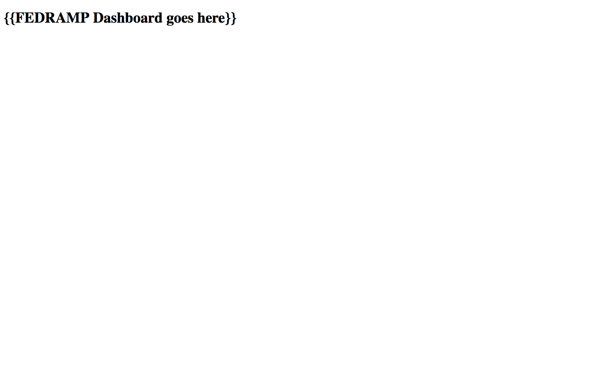

# Dashboard-delivery-demo

A toy project to demonstrate how things develop over time. It's hacky, but fun.



## Usage

``` sh
pip install -r requirements.txt
npm install -g serve

bash run.sh       # creates the screenshots
bash make_gif.sh  # creates the gif
```

## Public domain

This project is in the worldwide [public domain](LICENSE.md). As stated in [CONTRIBUTING](CONTRIBUTING.md):

> This project is in the public domain within the United States, and copyright and related rights in the work worldwide are waived through the [CC0 1.0 Universal public domain dedication](https://creativecommons.org/publicdomain/zero/1.0/).
>
> All contributions to this project will be released under the CC0 dedication. By submitting a pull request, you are agreeing to comply with this waiver of copyright interest.
